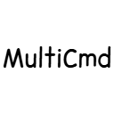

  
  <h1>🚀 MultiCmd (Fabric 1.21.+) v1.5.0</h1>
  
<strong>The Ultimate Batch Command, Macro & Lua Bot-Framework</strong>

  
  
  

---

<h2>🇬🇧 English Version (Click to expand)</h2>

**MultiCmd** has evolved from a simple batch executor into a full-fledged **Lua Bot-Framework**. Need to add 10 friends to 20 WorldGuard regions? Write a fully autonomous AFK farming script? Bind a 180-degree camera flick to a key? Do it all effortlessly!

### ✨ Key Features
* **🧠 Smart Parser:** Supports numeric/letter ranges `[1-10]`, `[a-z]`, lists `{Steve,Alex}`, and randomizers `?{A,B}`.
* **📜 Lua Scripting & Daemons:** Write powerful `.lua` algorithms. Supports background execution (Daemons) with `onTick` and `onHealthDrop` event listeners. **Thread-safe & Crash-free.**
* **⌨️ Dynamic Keybinds:** Bind macros, commands, or Lua scripts to any keyboard key on the fly (`/macro bind`).
* **🤖 Player Simulation:** The Lua API can simulate mouse clicks (`M1`/`M2`), key presses (`W`, `Space`), and precisely control the camera (`api:lookAt`).
* **👁️ World Interaction:** Scripts can raycast blocks and scan for nearby entities with exact coordinates and HP.
* **🛡️ SmartGuard Anti-Spam:** Commands are queued and dispatched with a configurable tick delay to prevent kicks.
* **🖥️ Smart Chat Alias (GUI):** Just type `m` in chat (configurable) to open an elegant control panel without sending the message to the server!

### 📚 Documentation
To learn how to write bots, macros, and use the Lua API, please read our official documentation:
👉 **[Read the SCRIPTING API Guide](SCRIPTING_API.md)**

### 📸 Media
*(Upload your screenshots to a `docs/` folder in your repo to make these links work)*

| Control Panel (GUI) | Toast Notifications & HUD |
|:---:|:---:|
|  |  |

### ⚙️ Installation
1. Install [Fabric Loader](https://fabricmc.net/) 0.16.5+.
2. Download **Fabric API** and **ModMenu**.
3. Drop the `MultiCmd` `.jar` into your `mods` folder.
*Note: This is a **Client-Side** mod. Do NOT install it on the server!*

### 📜 Commands
* `/batch <command|help>` — Execute a batch or view the in-game interactive guide.
* `/lua run <script>` — Execute a Lua script.
* `/lua stopall` — Terminate all background Daemons.
* `/macro bind <key> <command>` — Bind any macro/script to a keyboard key.
* `/group [add|remove|list]` — Manage player groups.
* `/multicmd cancel` — Emergency stop the command queue.

<h2>🇷🇺 Русская Версия (Нажмите, чтобы развернуть)</h2>

**MultiCmd** эволюционировал из простого распаковщика команд в **полноценный фреймворк для написания ботов**. Нужно заприватить 20 регионов? Написать автономный скрипт для АФК-фермы с поиском мобов? Привязать сложный разворот камеры к одной кнопке? MultiCmd сделает это легко!

### ✨ Главные возможности
* **🧠 Умный Парсер:** Поддерживает диапазоны `[1-10]`, `[a-z]`, списки `{Стив,Алекс}` и случайный выбор `?{А,Б}`.
* **📜 Lua Скриптинг и Демоны:** Пишите мощные алгоритмы. Скрипты могут работать в фоне (режим Демона), реагируя на тики игры (`onTick`) и урон (`onHealthDrop`). **100% защита от зависаний игры.**
* **⌨️ Динамические Бинды:** Привязывайте скрипты или макросы к любым клавишам прямо во время игры (`/macro bind`).
* **🤖 Симуляция Игрока:** Lua API умеет нажимать кнопки мыши (`M1/M2`), зажимать клавиши клавиатуры (`W`, `Space`) и вращать камеру (умный Аимбот через `api:lookAt`).
* **👁️ Взаимодействие с миром:** Скрипты могут сканировать блоки, на которые вы смотрите, и получать точные координаты и здоровье сущностей (мобов) вокруг.
* **🛡️ SmartGuard:** Защита от кика за спам благодаря умной настраиваемой очереди.
* **🖥️ Умный Алиас (GUI):** Просто напишите `m` в чате, чтобы открыть панель управления!

### 📚 Документация
Чтобы узнать, как писать своих ботов, макросы и использовать Lua API, прочитайте нашу официальную документацию:
👉 **[Читать руководство по SCRIPTING API](SCRIPTING_API.md)**

### 📸 Скриншоты

| Меню Управления | Уведомления и Прогресс-бар |
|:---:|:---:|
|  |  |

### ⚙️ Установка
1. Установите [Fabric Loader](https://fabricmc.net/) 0.16.5+.
2. Скачайте **Fabric API** и **ModMenu**.
3. Переместите `.jar` файл мода `MultiCmd` в папку `mods`.
*Примечание: Это **Клиентский** мод. Его НЕ нужно устанавливать на сервер!*

### 📜 Список команд
* `/batch <команда|help>` — Выполнить пакет или открыть внутриигровой гайд.
* `/lua run <скрипт>` — Запустить Lua скрипт.
* `/lua stopall` — Остановить всех фоновых ботов (демонов).
* `/macro bind <клавиша> <команда>` — Привязать скрипт/макрос к кнопке клавиатуры.
* `/group [add|remove|list]` — Управление группами игроков.
* `/multicmd cancel` — Экстренная остановка очереди.

---

  <i>Developed with ❤️ by TAOSHOI</i>

